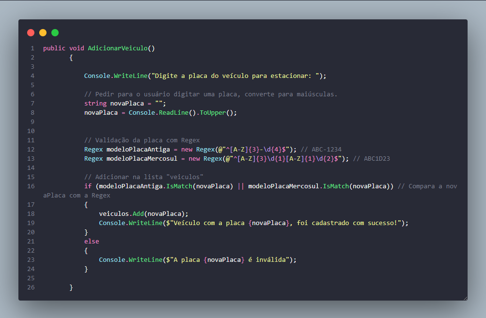
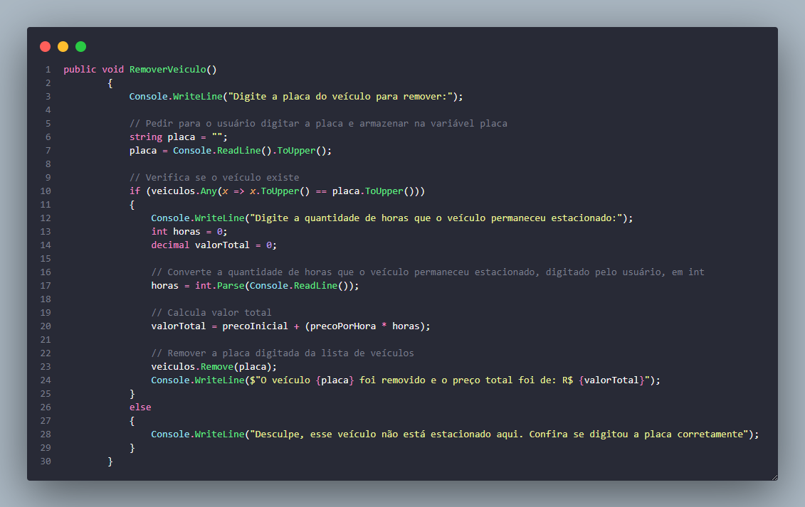
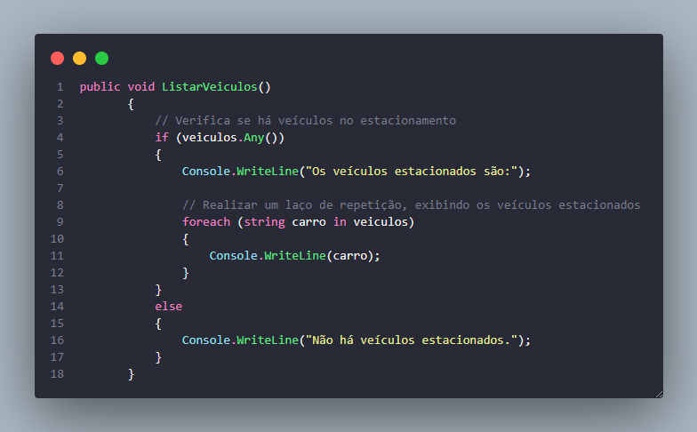

# DIO - Trilha .NET - Fundamentos
www.dio.me

## Desafio de projeto
Para este desafio, você precisará usar seus conhecimentos adquiridos no módulo de fundamentos, da trilha .NET da DIO.

Para ver a solução desenvolvida, clique [aqui](#solucao).

## Contexto
Você foi contratado para construir um sistema para um estacionamento, que será usado para gerenciar os veículos estacionados e realizar suas operações, como por exemplo adicionar um veículo, remover um veículo (e exibir o valor cobrado durante o período) e listar os veículos.

## Proposta
Você precisará construir uma classe chamada "Estacionamento", conforme o diagrama abaixo:

A classe contém três variáveis, sendo:

**precoInicial**: Tipo decimal. É o preço cobrado para deixar seu veículo estacionado.

**precoPorHora**: Tipo decimal. É o preço por hora que o veículo permanecer estacionado.

**veiculos**: É uma lista de string, representando uma coleção de veículos estacionados. Contém apenas a placa do veículo.

A classe contém três métodos, sendo:

**AdicionarVeiculo**: Método responsável por receber uma placa digitada pelo usuário e guardar na variável **veiculos**.

**RemoverVeiculo**: Método responsável por verificar se um determinado veículo está estacionado, e caso positivo, irá pedir a quantidade de horas que ele permaneceu no estacionamento. Após isso, realiza o seguinte cálculo: **precoInicial** * **precoPorHora**, exibindo para o usuário.

**ListarVeiculos**: Lista todos os veículos presentes atualmente no estacionamento. Caso não haja nenhum, exibir a mensagem "Não há veículos estacionados".

Por último, deverá ser feito um menu interativo com as seguintes ações implementadas:
1. Cadastrar veículo
2. Remover veículo
3. Listar veículos
4. Encerrar

## <h1 id="solucao" >Solução Desenvolvida </h1> 

- <strong>AdicionarVeiculo()</strong> solicita ao usuário que insira a placa de um veículo para estacionamento. Em seguida, converte essa entrada para letras maiúsculas.  
Posteriormente, utilizei expressões regulares para validar se a placa inserida corresponde a um dos dois formatos esperados: o formato convencional (ABC-1234) ou o formato do modelo Mercosul (ABC1D23). 
Se a placa inserida estiver em um dos formatos aceitáveis, ela é adicionada a uma lista de veículos registrados, exibindo uma mensagem de sucesso. Caso contrário, o sistema informa que a placa é inválida. 
 
 
- <strong>RemoverVeiculo()</strong> permite a remoção de um veículo estacionado. O usuário é solicitado a inserir a placa do veículo que deseja remover. A entrada é convertida para letras maiúsculas para garantir consistência. 
O sistema pede ao usuário para inserir a quantidade de horas que o veículo permaneceu estacionado, convertento o valor de string para int. 
Em seguida, com base nas horas fornecidas pelo usuário, o código calcula o valor total a ser pago pelo estacionamento. Esse valor é calculado usando um preço inicial e um preço por hora definidos previamente. 
Posteriormente, o veículo associado à placa inserida é removido da lista de veículos estacionados, e uma mensagem é exibida informando que o veículo foi removido com sucesso, juntamente com o preço total do estacionamento. 

 
- <strong>ListarVeiculos()</strong> verifica se há veículos estacionados na lista. Se houver algum veículo, o método percorre a lista utilizando um laço de repetição foreach e exibe cada veículo presente no estacionamento no console. 
